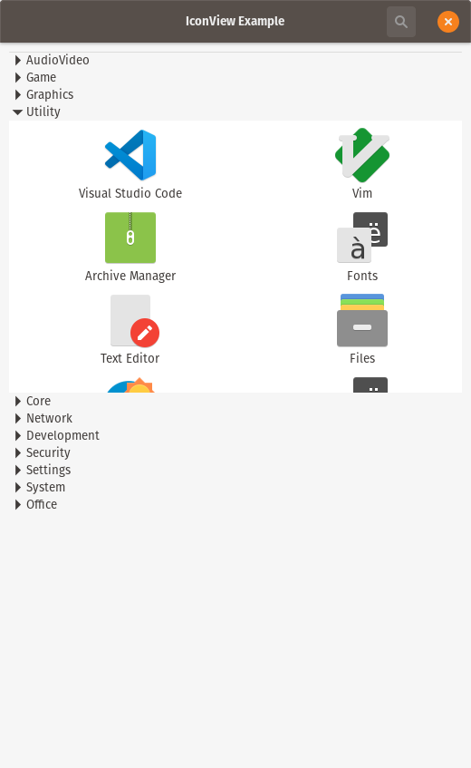

# gtk-app-launcher-rs
App search and app launch using GTK and Rust

# Purpose
To learn how to locate all installed applications on the linux system, display then categorized with Expander and IconView and launch an app on click.